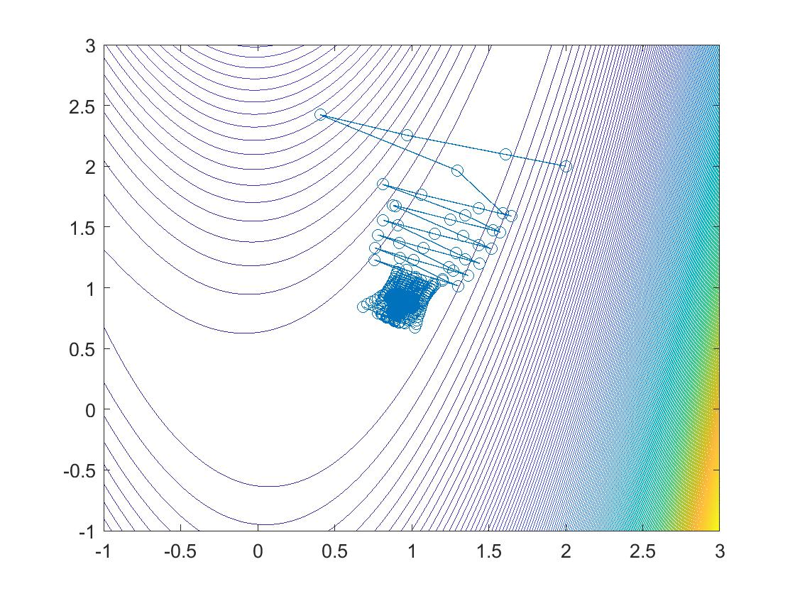
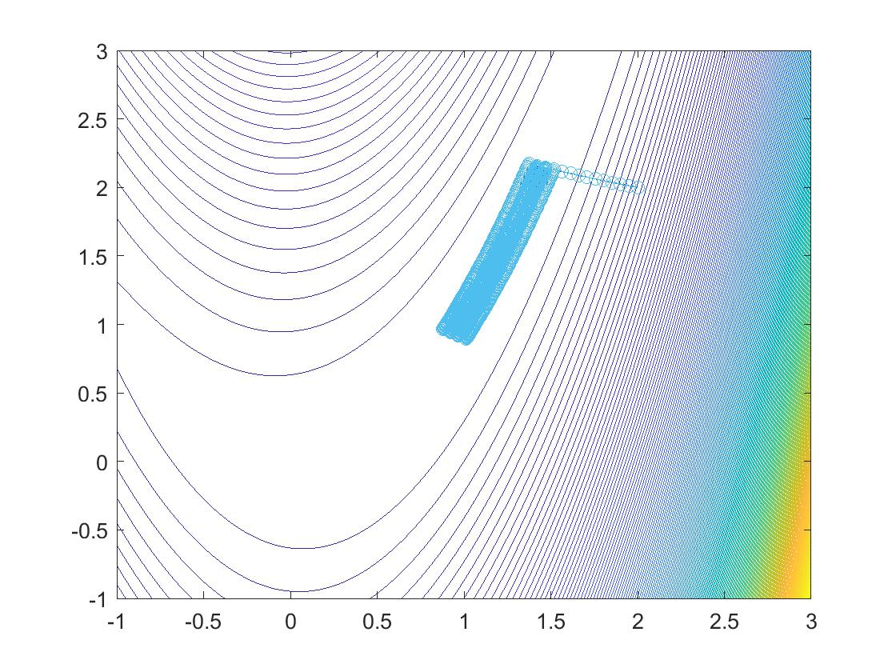

## Trust-region optimization

This is a handbook level implementation of trust-region optimization algorithm based on Dogeleg and Cauchy methods.

### Results
Below, the results for running the algorithm based on two methods are illustrated.

The function to optimize is (1 − 𝑥)^2 + 10(𝑦 − 𝑥2)^2 .

Result using Dogleg

Result using Cauchy

### Reference
Jorge Nocedal and Stephen J. Wright, Numerical Optimization, 2nd ed, Springer Series in Operations Research and Financial Engineering
